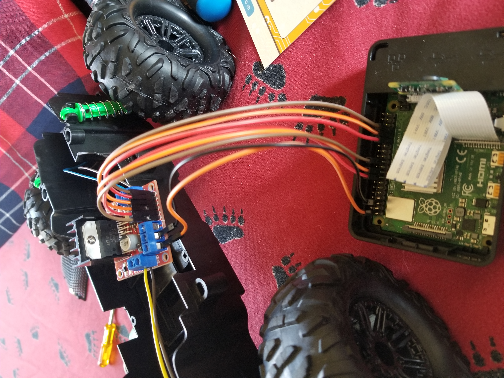
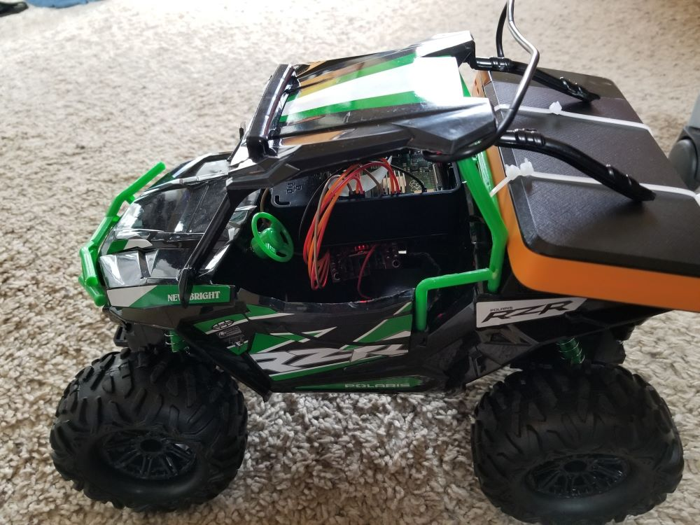
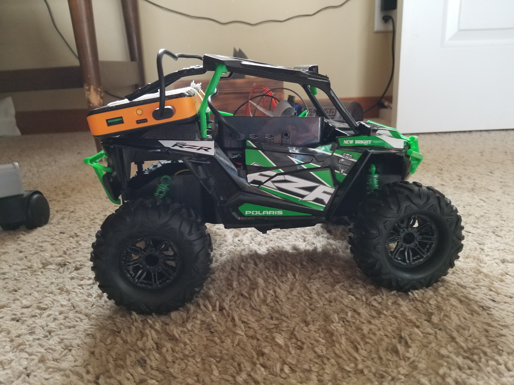

# Autonomous RC - Hacking a $20 Walmart RC car

### Supplies
* Walmart RC car
* Raspberry Pi
* PiCamera
* L298N motor driver
* External battery pack
* Various wires

### Tools
* OpenCV
* Python

### Capabilities (~~TODO~~)
* Drive via keyboard
* ~~Follow a line~~
* ~~Avoid obsticles~~
* ~~Recognize stop signs, pedestrians~~
* ~~Lane following~~
* ~~Follow a dog~~
* ~~Follow a person~~
* ~~Do donuts~~

### Pictures
Wiring \

Front \

Sides \

